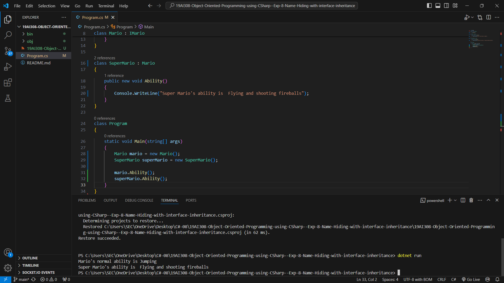

# 19AI308-Object-Oriented-Programming-using-CSharp--Exp-8-Name-Hiding-with-interface-inheritance
# AIM:
To implement name hiding with interface inheritance. Aim is to create an interface IMario with a method Ability(). 
Implement this interface in a class Mario and override the Ability() method also to create another class SuperMario that inherits from Mario 
and hides the Ability() method using the new keyword.

# PROGRAM:
```
using System;

public interface IMario
{
    void Ability();
}

class Mario : IMario
{
    public virtual void Ability()
    {
        Console.WriteLine("Mario's normal ability is Jumping");
    }
}

class SuperMario : Mario
{
    public new void Ability()
    {
        Console.WriteLine("Super Mario's ability is  Flying and shooting fireballs");
    }
}

class Program
{
    static void Main(string[] args)
    {
        Mario mario = new Mario();
        SuperMario superMario = new SuperMario();

        mario.Ability(); 
        superMario.Ability();
    }
}
```
# OUTPUT:



# RESULT:
Thus, the program has been executed successfully.
